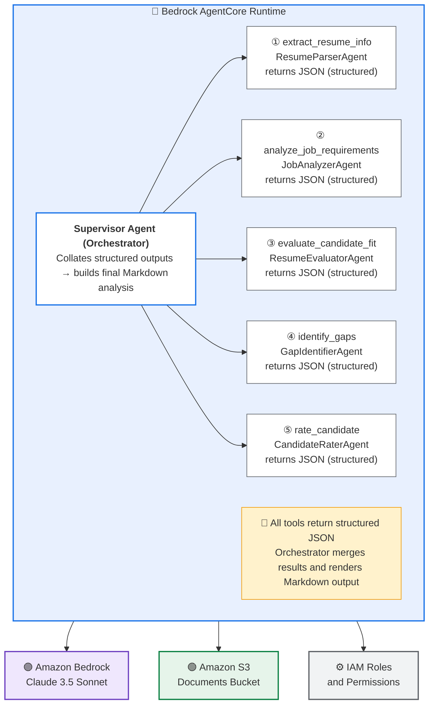

# Resume Analyzer Agent

## Overview

An AI-powered resume analysis system built on Amazon Bedrock AgentCore Runtime using multi-agent collaboration with Strands framework. The system evaluates candidate resumes against job descriptions using specialized AI agents with conversational memory.

## Architecture

```
┌─────────────────────────────────────────────────────────────────┐
│                        Streamlit UI                              │
│                  (streamlit_display.py)                          │
└────────────────────────┬────────────────────────────────────────┘
                         │
                         ▼
┌─────────────────────────────────────────────────────────────────┐
│              Amazon Bedrock AgentCore Runtime                    │
│                  (resume_analyzer_agent.py)                      │
├─────────────────────────────────────────────────────────────────┤
│  ┌───────────────────────────────────────────────────────────┐  │
│  │           HR Supervisor Agent (Orchestrator)              │  │
│  │  • Coordinates specialized agents                         │  │
│  │  • Manages workflow and final evaluation                  │  │
│  │  • Memory-enabled for follow-up questions                 │  │
│  └───────────────────────────────────────────────────────────┘  │
│                              │                                   │
│              ┌───────────────┼───────────────┬───────────────┐  │
│              ▼               ▼               ▼               ▼  │
│  ┌─────────────────┐ ┌─────────────┐ ┌──────────────────┐      │
│  │ Resume Parser   │ │ Job Analyzer│ │ Resume Evaluator │      │
│  │ Agent (Tool)    │ │ Agent (Tool)│ │ Agent (Tool)     │      │
│  └─────────────────┘ └─────────────┘ └──────────────────┘      │
│              ▼               ▼               ▼                  │
│  ┌─────────────────┐ ┌─────────────────────────────────┐       │
│  │ Gap Identifier  │ │   Candidate Rater Agent (Tool)  │       │
│  │ Agent (Tool)    │ │                                 │       │
│  └─────────────────┘ └─────────────────────────────────┘       │
└─────────────────────────────────────────────────────────────────┘
                         │
                         ▼
┌─────────────────────────────────────────────────────────────────┐
│                    AWS Infrastructure                            │
├─────────────────────────────────────────────────────────────────┤
│  • S3 Bucket (Resumes & Job Descriptions)                       │
│  • IAM Role (AgentCore Execution)                               │
│  • Memory Manager (Conversational Context)                      │
│  • CloudWatch Logs                                              │
└─────────────────────────────────────────────────────────────────┘
```

## Bedrock AgentCore Runtime - Detailed View



### Tool Flow

1. **extract_resume_info(resume_text)** → Parses resume into structured data
2. **analyze_job_requirements(job_description)** → Extracts job requirements
3. **evaluate_candidate_fit(resume_info, job_requirements)** → Compares candidate vs job
4. **identify_gaps(resume_info, job_requirements)** → Finds missing qualifications
5. **rate_candidate(resume_info, job_requirements, evaluation_info)** → Provides 1-5 score

## Key Features

- **Multi-Agent Collaboration**: Supervisor agent orchestrates 5 specialized agents
- **Conversational Memory**: Session-based memory for follow-up questions
- **Document Processing**: Supports PDF, DOCX, and TXT formats
- **Structured Output**: Markdown-formatted evaluation reports
- **AWS Integration**: S3 storage, IAM roles, CloudWatch logging

## Setup

### 1. Install uv (if not already installed)

```bash
# Linux/macOS
curl -LsSf https://astral.sh/uv/install.sh | sh

# Windows
powershell -c "irm https://astral.sh/uv/install.ps1 | iex"
```

### 2. Create and Activate Virtual Environment

```bash
# Create virtual environment
uv venv

# Activate virtual environment
# Linux/macOS
source .venv/bin/activate

# Windows (PowerShell)
.venv\Scripts\activate

# Windows (Git Bash)
source .venv/Scripts/activate
```

### 3. Install Dependencies

```bash
# Install from requirements.txt
uv pip install -r requirements.txt
```

## Deployment

### 1. Deploy Infrastructure and Agent

Run the deployment script to create the CloudFormation stack and deploy the agent to Bedrock AgentCore Runtime:

```bash
# Linux/macOS/Git Bash
./deploy.sh

# Windows (PowerShell)
bash deploy.sh
```

This script will:
- Deploy CloudFormation stack (S3 bucket, IAM role)
- Configure and deploy the agent to Bedrock AgentCore Runtime

### 2. Run Streamlit UI

After successful deployment, launch the Streamlit interface:

```bash
streamlit run streamlit_display.py
```
