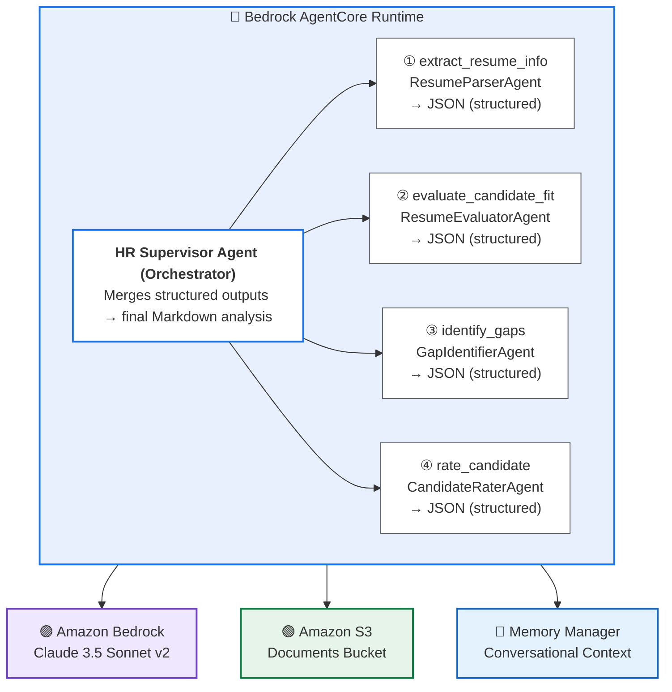

# Resume Analyzer Agent

An AI-powered resume analysis system built on **Amazon Bedrock AgentCore Runtime** using multi-agent collaboration with the **Strands** framework. The system evaluates candidate resumes against job descriptions using specialized AI agents with conversational memory.

---

## Table of Contents

- [Architecture](#architecture)
- [How It Works](#how-it-works)
- [Tech Stack](#tech-stack)
- [Project Structure](#project-structure)
- [Prerequisites](#prerequisites)
- [Local Development](#local-development)
- [AWS Deployment](#aws-deployment)
- [Environment Variables](#environment-variables)
- [S3 Bucket Structure](#s3-bucket-structure)
- [API Reference](#api-reference)
- [Cleanup](#cleanup)

---

## Architecture

```
┌─────────────────────────────────────────────────────────────────────┐
│                    Browser  (React 18 + TypeScript)                  │
│                         ui/src/  (Vite SPA)                          │
└────────────────────────────────┬────────────────────────────────────┘
                                 │ HTTPS
                                 ▼
              ┌──────────────────────────────────┐
              │   CloudFront + API Gateway        │
              │   (Custom domain via ACM cert)    │
              └──────────────┬──────┬────────────┘
                             │      │
                    ┌────────┘      └─────────────┐
                    ▼                             ▼
        ┌───────────────────┐        ┌────────────────────────┐
        │   API Lambda      │        │   UI  (S3 + CloudFront)│
        │  (Express.js)     │        │   Static assets        │
        └────────┬──────────┘        └────────────────────────┘
                 │  AWS SDK v3
        ┌────────┼──────────┬──────────────────────┐
        ▼        ▼          ▼                      ▼
    ┌───────┐ ┌────────┐ ┌──────────────────┐  ┌─────────────────┐
    │  S3   │ │Dynamo  │ │ Bedrock AgentCore│  │  S3 Trigger     │
    │(docs) │ │  DB    │ │    Runtime       │  │  Lambda         │
    └───────┘ └────────┘ └────────┬─────────┘  └────────┬────────┘
                                  │                      │
                   ┌──────────────┴──────────────────────┘
                   ▼
      ┌──────────────────────────────────────────────────────┐
      │              Bedrock AgentCore Runtime                │
      │              (resume_analyzer_agent.py)               │
      │                                                        │
      │  ┌──────────────────────────────────────────────┐    │
      │  │         HR Supervisor Agent (Orchestrator)    │    │
      │  │  Coordinates tools, merges results →  JSON   │    │
      │  └──────────────────────────────────────────────┘    │
      │     │           │            │              │         │
      │     ▼           ▼            ▼              ▼         │
      │  ┌──────┐  ┌─────────┐  ┌────────┐  ┌──────────┐    │
      │  │Resume│  │Evaluator│  │  Gap   │  │Candidate │    │
      │  │Parser│  │  Tool   │  │Finder  │  │  Rater   │    │
      │  │ Tool │  │         │  │  Tool  │  │  Tool    │    │
      │  └──────┘  └─────────┘  └────────┘  └──────────┘    │
      └───────────────────────────┬──────────────────────────┘
                                  │
                                  ▼
                    ┌─────────────────────────┐
                    │    Amazon Bedrock        │
                    │  Claude 3.5 Sonnet v2    │
                    └─────────────────────────┘
```

### Bedrock AgentCore Runtime — Agent Tool Flow


```mermaid
graph TB
    subgraph Runtime["🔷 Bedrock AgentCore Runtime"]
        Orchestrator["<b>HR Supervisor Agent (Orchestrator)</b><br/>Merges structured outputs → final Markdown analysis"]

        Tool1["① extract_resume_info<br/>ResumeParserAgent<br/>→ JSON (structured)"]
        Tool2["② evaluate_candidate_fit<br/>ResumeEvaluatorAgent<br/>→ JSON (structured)"]
        Tool3["③ identify_gaps<br/>GapIdentifierAgent<br/>→ JSON (structured)"]
        Tool4["④ rate_candidate<br/>CandidateRaterAgent<br/>→ JSON (structured)"]

        Orchestrator --> Tool1
        Orchestrator --> Tool2
        Orchestrator --> Tool3
        Orchestrator --> Tool4
    end

    Runtime --> Bedrock["🟣 Amazon Bedrock<br/>Claude 3.5 Sonnet v2"]
    Runtime --> S3["🟢 Amazon S3<br/>Documents Bucket"]
    Runtime --> Memory["🔵 Memory Manager<br/>Conversational Context"]

    style Runtime fill:#E8F0FE,stroke:#1a73e8,stroke-width:2px
    style Orchestrator fill:#ffffff,stroke:#1a73e8,stroke-width:2px
    style Tool1 fill:#ffffff,stroke:#5f6368,stroke-width:1px
    style Tool2 fill:#ffffff,stroke:#5f6368,stroke-width:1px
    style Tool3 fill:#ffffff,stroke:#5f6368,stroke-width:1px
    style Tool4 fill:#ffffff,stroke:#5f6368,stroke-width:1px
    style Bedrock fill:#EFE7FD,stroke:#6f42c1,stroke-width:2px
    style S3 fill:#E6F4EA,stroke:#0b8043,stroke-width:2px
    style Memory fill:#E3F2FD,stroke:#1565c0,stroke-width:2px
```

### Automated Resume Ingestion Flow (S3 Trigger)

```
Resume uploaded to S3
        │
        ▼
  S3 Event → Lambda Trigger
        │
        ├─ Assigns unique Candidate ID (CAND_XXXXXX via DynamoDB counter)
        ├─ Moves file to structured S3 path
        ├─ Waits for Job Description JSON
        │
        ▼
  Invokes Bedrock AgentCore Runtime (async)
        │
        ├─ Agent downloads resume + JD from S3
        ├─ Runs multi-agent analysis pipeline
        ├─ Uploads analysis.json to S3
        │
        ▼
  Lambda polls for analysis.json
        │
        └─ Updates DynamoDB (status=COMPLETED, overallScore, candidateName)
```

---

## How It Works

### Three Operating Modes

| Mode | Trigger | Description |
|------|---------|-------------|
| **JD Analysis** | Upload a job description | Extracts structured requirements (title, skills, qualifications) |
| **Resume Analysis** | Upload a candidate resume | Full evaluation against the job — score, gaps, recommendation |
| **Conversational Query** | Follow-up chat message | Memory-aware Q&A about a candidate or job using prior context |

### Analysis Output Schema

```json
{
  "candidate": {
    "id": "CAND_000001",
    "name": "Jane Doe",
    "level": "Senior",
    "experienceYears": 8,
    "overallScore": 87,
    "coreScore": 90,
    "domainScore": 85,
    "softScore": 82,
    "initials": "JD"
  },
  "coreSkills": [
    { "name": "Python", "years": 6, "level": "Expert", "status": "match" }
  ],
  "domainSkills": [
    { "skill": "MLOps", "priority": "High", "level": "Proficient", "evidence": "Led ML platform migration..." }
  ],
  "evidenceSnippets": ["5+ years Python...", "Led team of 10..."],
  "gaps": ["No Kubernetes experience", "Missing security certifications"],
  "recommendation": "Strong match. Recommend for technical interview."
}
```

---

## Tech Stack

| Layer | Technology |
|-------|-----------|
| **AI Runtime** | Amazon Bedrock AgentCore Runtime |
| **LLM** | Claude 3.5 Sonnet v2 (`us.anthropic.claude-3-5-sonnet-20241022-v2:0`) |
| **Agent Framework** | [Strands Agents](https://github.com/strands-agents/sdk-python) |
| **Memory** | Bedrock AgentCore Memory Manager (MemorySession, 30-day retention) |
| **Backend API** | Node.js + Express.js (Lambda via serverless-express) |
| **Frontend** | React 18 + TypeScript + Vite |
| **Infrastructure** | AWS CloudFormation (5 stacks) |
| **Storage** | Amazon S3 (documents), DynamoDB (metadata & counters) |
| **Automation** | S3 event trigger → Lambda → AgentCore |
| **Dev UI** | Streamlit (`streamlit_display.py`) |
| **Container** | Docker (linux/arm64, deployed to ECR) |
| **IaC** | AWS CloudFormation YAML |

---

## Project Structure

```
resume-analyzer-v2/
├── agents/
│   └── resume_analyzer_agent.py     # AgentCore Runtime entrypoint (multi-agent logic)
├── api/
│   ├── server.js                    # Express REST API (runs as Lambda)
│   ├── lambda.js                    # serverless-express wrapper
│   └── package.json
├── ui/
│   └── src/
│       ├── App.tsx
│       ├── api/
│       │   ├── client.ts            # API client (all backend calls)
│       │   └── types.ts             # TypeScript interfaces
│       └── components/
│           ├── Opportunities.tsx    # Job listings screen
│           ├── Analysis.tsx         # Candidate analysis screen
│           ├── UploadResume.tsx
│           └── BulkUpload.tsx
├── infra/
│   ├── deploy.sh                    # Main deployment orchestrator
│   ├── deploy_agent.py              # Deploys agent to AgentCore Runtime
│   ├── deploy_api_lambda.py         # Packages and uploads API Lambda
│   ├── deploy_ui.py                 # Builds React app and deploys to S3
│   ├── deploy_lambda.py             # Deploys S3 trigger Lambda
│   ├── lambda_trigger.py            # S3 event handler (automated ingestion)
│   ├── cleanup.sh / cleanup_aws.py  # Stack teardown
│   ├── template-infrastructure.yaml           # Main stack
│   ├── template-infrastructure-roles.yaml     # IAM roles
│   ├── template-infrastructure-storage.yaml   # S3, DynamoDB, trigger Lambda
│   ├── template-infrastructure-api.yaml       # API Gateway + API Lambda
│   └── template-infrastructure-ui.yaml        # CloudFront + S3 (UI hosting)
├── streamlit_display.py             # Alternative dev UI
├── invoke_agent.py                  # Direct agent invocation example
├── query_analysis.py                # DynamoDB query CLI
├── s3_utils.py                      # S3 helper utilities
├── create_s3_folders.py             # S3 folder structure setup
├── requirements.txt                 # Python dependencies
├── Dockerfile                       # Container image for AgentCore
└── .bedrock_agentcore.yaml          # AgentCore Runtime configuration
```

---

## Prerequisites

- **AWS Account** with Bedrock model access (Claude 3.5 Sonnet) enabled in `us-east-1`
- **AWS CLI** configured with sufficient IAM permissions
- **Python 3.11+** and [uv](https://github.com/astral-sh/uv)
- **Node.js 18+** and npm
- **Docker** (for building the AgentCore container)
- **Bedrock AgentCore** enabled in your AWS account

---

## Local Development

### 1. Python environment

```bash
# Create and activate virtual environment
uv venv
source .venv/bin/activate        # Linux/macOS
source .venv/Scripts/activate    # Windows (Git Bash)

# Install dependencies
uv pip install -r requirements.txt
```

### 2. Streamlit UI (quickest dev loop)

```bash
streamlit run streamlit_display.py
```

The Streamlit UI connects directly to Bedrock AgentCore Runtime (you must have deployed the agent first). It provides file upload, streaming analysis, and follow-up chat.

### 3. React UI + API (full stack locally)

```bash
# Start API server
cd api
npm install
npm run dev      # Runs on http://localhost:3000

# Start React dev server (separate terminal)
cd ui
npm install
npm run dev      # Runs on http://localhost:5173
```

Set these env vars before starting the API:

```bash
export AWS_REGION=us-east-1
export BUCKET_NAME=<your-s3-bucket>
export OPPORTUNITIES_TABLE=JobAnalysis-agentcore
export CANDIDATE_TABLE=CandidateAnalysis-agentcore
export AGENT_ARN=<agent-arn-from-deployment>
```

---

## AWS Deployment

### Full production deployment

```bash
cd infra
./deploy.sh
```

This script runs all steps in order:

| Step | Action |
|------|--------|
| 1 | Deploy IAM roles stack |
| 2 | Deploy storage stack (S3, DynamoDB, trigger Lambda) |
| 3 | Build container and deploy agent to AgentCore Runtime |
| 4 | Update storage stack with real Agent ARN |
| 5 | Upload and deploy API Lambda |
| 6 | Deploy API Gateway stack |
| 7 | Build React app and deploy to S3 + CloudFront |
| 8 | Deploy S3 trigger Lambda code |

**Outputs**: Agent ARN written to `infra/.agent_arn`. API Gateway and CloudFront URLs printed to console.

### Deploy agent only (after code changes)

```bash
cd infra
python deploy_agent.py
```

### Deploy UI only (after frontend changes)

```bash
cd infra
python deploy_ui.py
```

---

## Environment Variables

### Agent Container (set automatically by `deploy_agent.py`)

| Variable | Description |
|----------|-------------|
| `AWS_REGION` | AWS region (default: `us-east-1`) |
| `DOCUMENTS_BUCKET` | S3 bucket name for resumes and JDs |
| `DOCKER_CONTAINER` | Set to `1` in Dockerfile |

### API Lambda

| Variable | Description |
|----------|-------------|
| `AWS_REGION` | AWS region |
| `BUCKET_NAME` | S3 bucket name |
| `OPPORTUNITIES_TABLE` | DynamoDB job analysis table name |
| `CANDIDATE_TABLE` | DynamoDB candidate analysis table name |
| `AGENT_ARN` | Bedrock AgentCore Runtime ARN |

### S3 Trigger Lambda

| Variable | Description |
|----------|-------------|
| `AGENT_ARN` | Bedrock AgentCore Runtime ARN |
| `ENVIRONMENT` | Stack environment suffix (e.g. `agentcore`) |

### Streamlit (optional)

| Variable | Description |
|----------|-------------|
| `STREAMLIT_DEBUG` | Set to `true` for verbose debug logging |
| `STREAMLIT_SERVER_HEADLESS` | Set to `true` for server mode |

---

## S3 Bucket Structure

```
s3://<bucket>/
├── opportunities/
│   └── <SO_ID>/                         # Job opportunity folder
│       ├── jd/
│       │   ├── job_description.pdf      # Raw JD upload
│       │   └── jd.json                  # Structured JD output (agent)
│       └── candidates/
│           └── CAND_XXXXXX/             # Unique candidate folder
│               ├── resume.pdf           # Original resume
│               └── analysis.json        # Full analysis output (agent)
├── resumes/
│   └── <TIMESTAMP>_<filename>.pdf       # Streamlit UI uploads
└── jobs/
    └── <TIMESTAMP>_<filename>.pdf       # Streamlit UI job descriptions
```

---

## API Reference

The Express API is deployed as a Lambda behind API Gateway.

| Method | Route | Description |
|--------|-------|-------------|
| `GET` | `/opportunities` | List all job opportunities |
| `POST` | `/opportunities/upload-jd` | Get presigned S3 URL for JD upload |
| `GET` | `/opportunities/:id/analysis` | Get analysis (JD summary + all candidates) |
| `POST` | `/upload-url` | Get presigned S3 URL for resume upload |
| `GET` | `/files?prefix=...` | List files in an S3 prefix |
| `PATCH` | `/opportunities/:id/candidates/:cid/select` | Mark a candidate as SELECTED |
| `POST` | `/chat` | Send a follow-up question to the agent |

### DynamoDB Tables

| Table | Partition Key | Sort Key | Purpose |
|-------|--------------|----------|---------|
| `JobAnalysis-{env}` | `jobDescriptionId` | — | Job descriptions and status |
| `CandidateAnalysis-{env}` | `jobDescriptionId` | `candidateId` | Candidate results and scores |
| `Counters-{env}` | `counterId` | — | Monotonic counter for Candidate IDs |

---

## Cleanup

```bash
# Remove all deployed AWS resources
python infra/cleanup_aws.py

# Or use the shell script
cd infra && ./cleanup.sh
```

> **Warning**: This deletes all CloudFormation stacks, the S3 bucket (and all documents), DynamoDB tables, the AgentCore Runtime, and the ECR repository.
